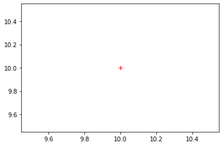
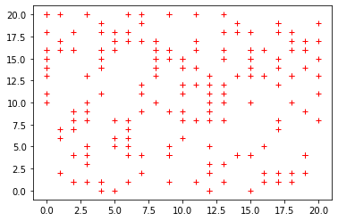
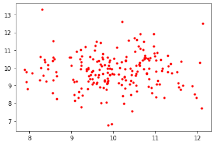
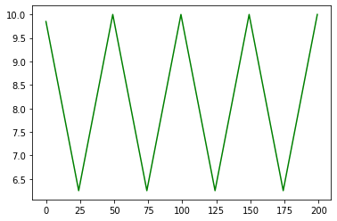

# Lab 6 -- Data Generator

This is a group lab that will contribute towards your final project. One
person will submit this work.

{width="6.1375in"
height="1.7333333333333334in"}Most application depends on data. In IoT
data is collected/generated by sensors. Since we do not have access to
sensors, we will have to generate data via code. Plotting a sufficient
number of these data points (500 in this case) should get the following
diagram or something very similar:

You will pick a quantity that you would like to simulate (such as
temperature, humidity, barometric pressure, customers arriving at a
mall, or just with an alternate descriptor) and decide what shape you
will emulate. This will guide you in selecting sensible values or
baselines for your data values (e.g., If you pick inside temperature
then the normal range will be 18-21^o^C).

Design and build a class that will model your sensor reasonably well.
Notice how the peaks do not occur at regular intervals, nor are they the
same height. Even the squiggles are the same shapes.

You will create a class with a single public member (property) that
provides a \"random\" value in your intended range and properties. You
should create a private method that actually generates a normalized
value \[a normalized value will be in the range 0 to 1\]. Then transform
this value by scaling and or transposing it to the range that you are
interested in.

Your class must have a fair amount of customization but at the same time
should be easy to use, so provide a constructor with lots of default
values. Make it so that you can generate your data by repeatedly
accessing a property of the class instance. There must not be a limit to
the number of values that you can get from your generator.

*All your subsequent labs MUST use this class when working with random
values.*

See sample code in the subsequent pages.

{width="6.1375in"
height="3.036111111111111in"}

{width="6.031944444444444in"
height="3.745138888888889in"}

## Due:

See the course calendar.

## Requirements:

1.  Create a **class** that does the following:

2.  Create a **private method** that will generate random values in the
    range 0 - 1. Look at the examples at the end of this document for
    ideas on approaching this.

3.  This method may take argument that can be passed by the property
    below.

4.  Create a **public** **property** that will use the above member to
    return a value in your preferred range. You may use a simple
    transformation of the form:

5.  You will use the Matplotlib library to display your data values. The
    output must look professional. You will label your **output axes**
    and **title** appropriately.

6.  Code to drive (run your program)

See the appendix of this document for sample code and possible
directions to explore. You will need some combination of the last three
examples. DO NOT USE THE CODE AS IS! Look at the intention behind the
code.

#### Submission

1.  You must use only the libraries that are available in the standard
    Python distribution.

2.  Your code file will be named
    group\_«your_group_number»\_data_generator.py e.g.
    group_1\_data_generator.py.

3.  Must be uploaded to course dropbox before the deadline.

4.  See schedule for due date.

***Rubrics***

See requirements above.

## Sample Code:

The following examples illustrate the various possibilities for
generating data. You can also play with a [Jupyter
notebook](https://colab.research.google.com/drive/1QsxHRlUVITd-aQ0CMf_ubVw7qIdzXq_V?usp=sharing).

#### Constant Value

The first example gives you a constant value regardless of how many
times you call it.

import matplotlib.pyplot as plt

def generator_1() -\> int:

\'\'\'

This is the greatest generator.

It returns Narendra\'s favourite number

\'\'\'

return 10

number_of_values = 200

y = \[generator_1() for \_ in range(number_of_values)\]

x = \[generator_1() for \_ in range(number_of_values)\]

plt.plot(x, y, \'r+\')

plt.show()

{width="3.611111111111111in"
height="2.36875in"}

#### Uniform Values

The second example gives you a uniformly random value. It uses the
randint() method of the random class that returns a value in the
interval \[a, b\]. Uniform distributed values occur frequently in
everyday situations such as the odds of getting a particular value on
the toss of an un-biased die.

import matplotlib.pyplot as plt

import random

def generator_2() -\> int:

\'\'\'

This generator gives you a uniform random number in a 0 to 20

\'\'\'

return random.randint(0, 20)

number_of_values = 200

y = \[generator_2() for \_ in range(number_of_values)\]

x = \[generator_2() for \_ in range(number_of_values)\]

plt.plot(x, y, \'r+\')

plt.show()

{width="4.170138888888889in"
height="2.736111111111111in"}

#### Standard Values

The third example gives you a normal random value. It uses the gauss()
method of the random class that returns a value based on a mean and a
standard deviation. Normal/standard distributed values also occur
frequently in everyday situations such as the number of students in a
queue waiting for the TTC bus are the Progress terminal. This is
different because the number of students in the line quickly builds up
to a maximum when the bus has arrived and a minimum when there is no
bus.

import matplotlib.pyplot as plt

import random

def generator_3() -\> int:

return random.gauss(10, 1.0)

number_of_values = 200

y = \[generator_3() for \_ in range(number_of_values)\]

x = \[generator_3() for \_ in range(number_of_values)\]

plt.plot(x, y, \'r.\')

plt.show()

{width="5.445833333333334in"
height="3.658333333333333in"}

If you increase the number of points, you will see there is a cluster at
the centre of the grid.

#### Pattern Values

The fourth example gives you a value that follows a predictable pattern.
It uses the Gauss method of the random class that returns a value based
on a mean and a standard deviation. Normal/standard distributed values
also occur frequently in everyday situations such as the number of
students in a queue waiting for the TTC bus are the Progress terminal.
This is different because the number of students in the line quickly
builds up to a maximum when the bus has arrived and a minimum when there
is no bus.

value = {\'base\':10, \'delta\': 0.15}

def generator_4(increment = True) -\> float:

if increment:

value\[\'base\'\] += value\[\'delta\'\]

else:

value\[\'base\'\] -= value\[\'delta\'\]

return value\[\'base\'\]

number_of_values = 200

y = \[generator_4((x % 50) \> 24) for x in range(number_of_values)\]

plt.plot(y, \'g\')

plt.show()

{width="4.904861111111111in"
height="3.2104166666666667in"}
